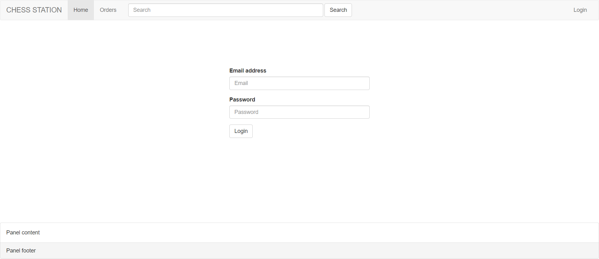
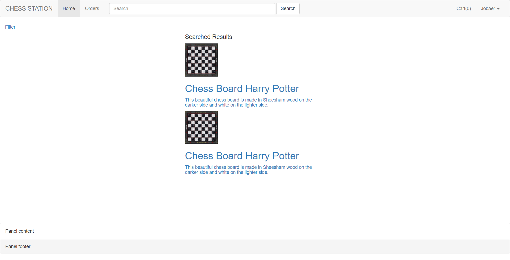
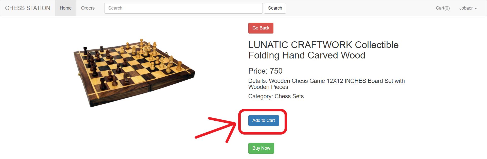
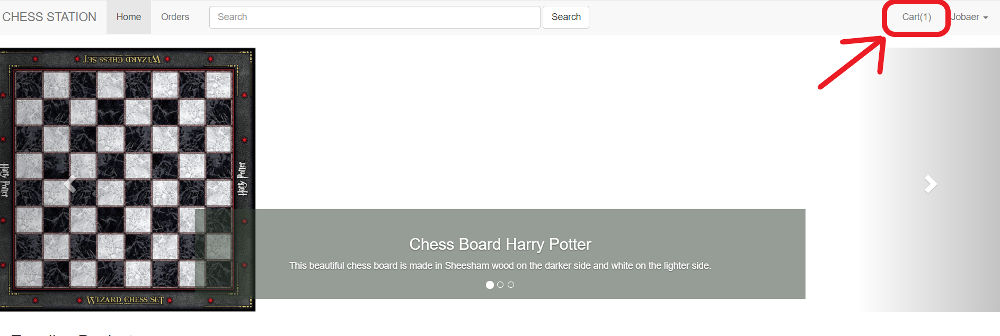
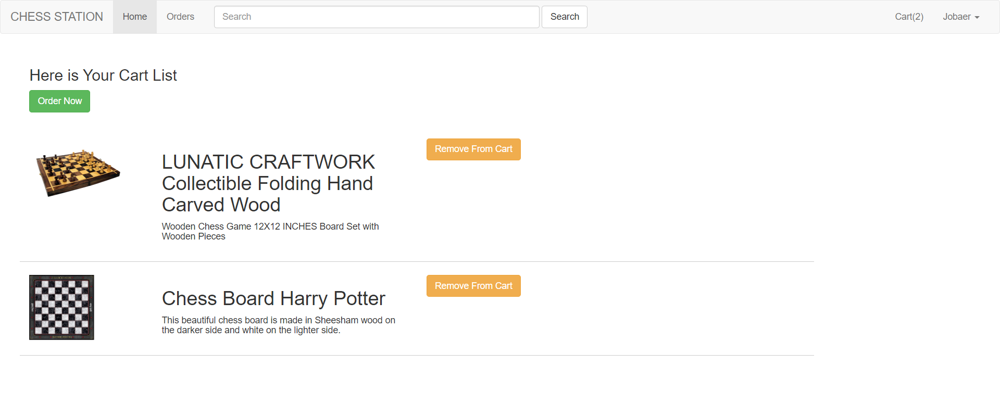
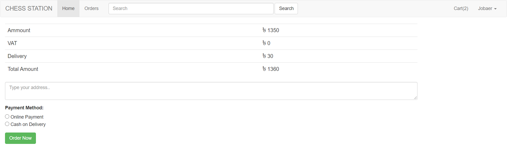

&nbsp;

&nbsp;

<strong></strong>

<strong>North South University</strong>

Department of Electrical &amp; Computer Engineering

<strong>Project Report</strong>

<strong>Group No</strong>: 14

<strong>Fall 2020</strong>

<strong>Project Name</strong>: Chess Station (Online Chess Store)

<strong>Course Title</strong>: CSE 299 (Junior Design)

<strong>Section</strong><strong>:</strong> 2

<strong>Faculty</strong>: Shaikh Shawon Arefin Shimon (SAS3)

<strong>Name</strong><strong>:</strong> Md. Abdullah Al Jobaer

<strong>ID</strong><strong>:&nbsp; </strong>1512028042

<strong>Email</strong><strong>:</strong> <a href="mailto:al.jobaer@northsouth.edu">al.jobaer@northsouth.edu</a>

<strong>Git Repository</strong><strong>: </strong><a href="https://github.com/NSU-FA20-CSE299-2/Group14">https://github.com/NSU-FA20-CSE299-2/Group14</a>

<strong>Date Prepared</strong><strong>: </strong>22/01/2021

<strong>&nbsp;</strong>

<strong>&nbsp;</strong>

<strong>ACKNOWLEDGEMENT</strong>

 I would like to thank my faculty Shaikh Shawon Arefin Shimon Sir.

During the production of this whole project I’ve learned a lot because of his guideline, help and strictness. Without his directions and instructions, I would not be able to pull the project this far alone.

&nbsp;

<strong>INTRODUCTION</strong>

In Bangladesh, especially in Dhaka City, there are so many people (other than the PROs) who love to play chess regularly, or every now and then. So many of them are so passionate about this game that they even want to buy stuff and accessories that are all about chess. Chess books, chess clocks, chess bags, chess T-shirts, for example, and, of course, along with different kinds and designs of chess boards and pieces of chess. The main objective was to create a platform for eCommerce where chess freaks can order and purchase their desired products online from anywhere in our country.

 Chess Station is an eCommerce website built with latest technologies.

&nbsp;

<strong>TECHNOLOGY</strong>

Implemented Technology Stack:

<strong>GitHub</strong> has been used for this project. Used <strong>Basic Kanban Board</strong> of GitHub as the project management tool. For <em>Frontend</em> part, used <strong>HTML5</strong> and <strong>CSS3</strong> and <strong>Bootstrap 3</strong>. Used <strong>VS Code</strong> as IDE. On the other hand, for <em>Backend</em>, used <strong>Laravel Framework</strong> and <strong>MySQL</strong> for the database.

&nbsp;

<strong>PROJECT FEATURES</strong>

<strong>(a) Home Page:</strong>

<strong></strong>

&nbsp;

<strong>(b) Single Product Page:</strong>
 

A user can click a product and it will go to the single product page.

<strong></strong>

&nbsp;

<strong>(c) Login Page:</strong>

Login: A user can login by using his email address and password

<strong></strong>

&nbsp;

<strong>(d) Login and Logout Functionality with Session:</strong>
 

Created a logout route for the Login and logout system and the dropdown menu shows the username when a user logs in.

<strong></strong>

&nbsp;

<strong>(e) Logout:</strong>
 

A user can easily logout by clicking the logout button in the dropdown menu (showing the username).

<strong></strong>

&nbsp;

<strong>(f) Search Page:</strong>
 

A user can search the products by any letter which is between the products’ name. Search page will filter the product searched list. Built the search functionality for the search page, get data from the database, and go to product detail from the search page.

Type the product or any letter to search:

<strong></strong>

It will show the search page with searched products:

<strong></strong>

&nbsp;

<strong>(g) Add to Cart Option:</strong>
 

A user can add products using the add to cart button in the single product page. Also Added the functionality to show the number count of product(s) added to cart. Anyone can browse the website and see the products but if he/clicks the add to cart button the website will redirect to its login page to force the user to login first.

<strong></strong>

Also Added the functionality to show the number count of product(s) added to cart:

<strong></strong>

&nbsp;

<strong>(h) Cart List Page:</strong>
 

The added product(s) will show in the Cart list page. It has a remove from cart option and order now option.

<strong></strong>

&nbsp;

<strong>(i) Order-Now Page: </strong>
 

When a user decides to order the added products from the cart page he/she can click the Ordernow option and the order-now page will appear with the whole product and delivery details with pricing. User can then type his/her valid address on the address bar and then after selecting the payment method he/she can select the ordernow button and the order will be placed. This will complete the ordering process. The address bar and payment method options are both required field. An order cannot procced without filling these two required fields. When an order is placed successfully the website will redirect to the home page and the cart count will show (0) on the navbar menu.

<strong></strong>

&nbsp;

&nbsp;

<strong>FUTURE WORKS AND PLAN</strong>

As this project is not ready yet to run for the production for the business plan that discussed in the project proposal, I would like to work on the development of remaining areas that need to be done to make it up-and-running for the primary goal for which it was proposed in the first place.

I would like to develop the remaining features like: user registration, admin panel, dashboard section in the admin panel where admin can see the information of whole system, payment methods, add payment gateway (i.e., bKash) for the successful online order and transaction.

In future, Chess Station will be selling imported chess products and accessories through online platform. By using this eCommerce website chess lovers will order and buy their desired products and accessories. Chess Station will sell various forms of products related to Chess to its customers and earn money through online payments or cash on delivery.

&nbsp;

