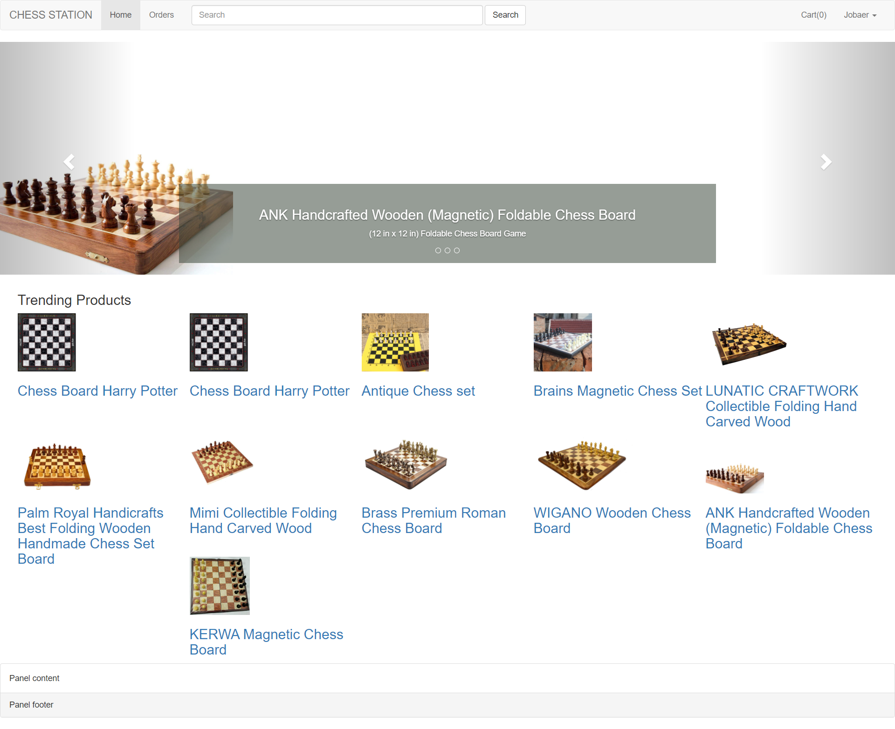
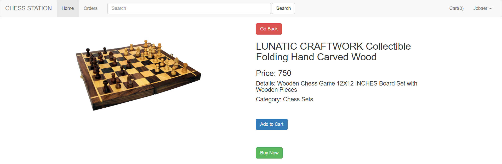
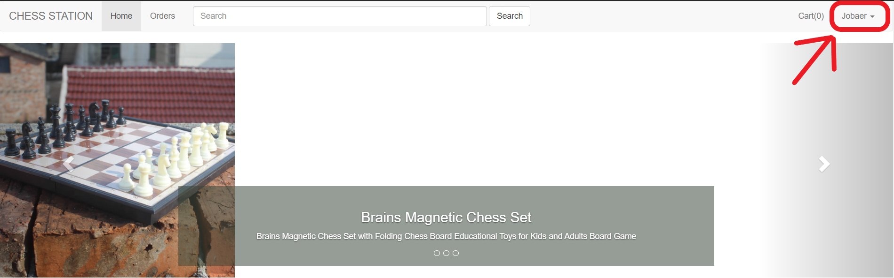
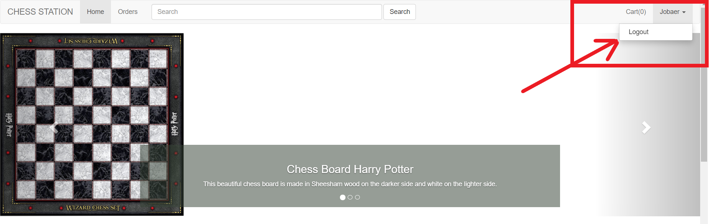
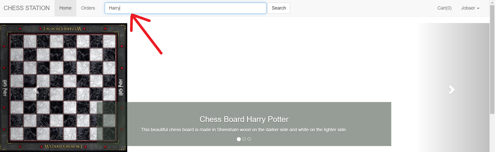

&nbsp;

&nbsp;

<strong></strong>

<strong>North South University</strong>

Department of Electrical &amp; Computer Engineering

<strong>Project Report</strong>

<strong>Group No</strong>: 14

<strong>Fall 2020</strong>

<strong>Project Name</strong>: Chess Station (Online Chess Store)

<strong>Course Title</strong>: CSE 299 (Junior Design)

<strong>Section</strong><strong>:</strong> 2

<strong>Faculty</strong>: Shaikh Shawon Arefin Shimon (SAS3)

<strong>Name</strong><strong>:</strong> Md. Abdullah Al Jobaer

<strong>ID</strong><strong>:&nbsp; </strong>1512028042

<strong>Email</strong><strong>:</strong> <a href="mailto:al.jobaer@northsouth.edu">al.jobaer@northsouth.edu</a>

<strong>Git Repository</strong><strong>: </strong><a href="https://github.com/NSU-FA20-CSE299-2/Group14">https://github.com/NSU-FA20-CSE299-2/Group14</a>

<strong>Date Prepared</strong><strong>: </strong>22/01/2021

<strong>&nbsp;</strong>

<strong>&nbsp;</strong>

<strong>ACKNOWLEDGEMENT</strong>

 I would like to thank my faculty Shaikh Shawon Arefin Shimon Sir.

During the production of this whole project I’ve learned a lot because of his guideline, help and strictness. Without his directions and instructions, I would not be able to pull the project this far alone.

&nbsp;

<strong>INTRODUCTION</strong>

In Bangladesh, especially in Dhaka City, there are so many people (other than the PROs) who love to play chess regularly, or every now and then. So many of them are so passionate about this game that they even want to buy stuff and accessories that are all about chess. Chess books, chess clocks, chess bags, chess T-shirts, for example, and, of course, along with different kinds and designs of chess boards and pieces of chess. The main objective was to create a platform for eCommerce where chess freaks can order and purchase their desired products online from anywhere in our country.

 Chess Station is an eCommerce website built with latest technologies.

&nbsp;

<strong>TECHNOLOGY</strong>

Implemented Technology Stack:

<strong>GitHub</strong> has been used for this project. Used <strong>Basic Kanban Board</strong> of GitHub as the project management tool. For <em>Frontend</em> part, used <strong>HTML5</strong> and <strong>CSS3</strong> and <strong>Bootstrap 3</strong>. Used <strong>VS Code</strong> as IDE. On the other hand, for <em>Backend</em>, used <strong>Laravel Framework</strong> and <strong>MySQL</strong> for the database.

&nbsp;

<strong>PROJECT FEATURES</strong>

<strong>(a) Home Page:</strong>

<strong></strong>

&nbsp;

<strong>(b) Single Product Page:</strong>
 

A user can click a product and it will go to the single product page.

<strong></strong>

&nbsp;

<strong>(c) Login Page:</strong>

Login: A user can login by using his email address and password

<strong></strong>

&nbsp;

<strong>(d) Login and Logout Functionality with Session:</strong>
 

Created a logout route for the Login and logout system and the dropdown menu shows the username when a user logs in.

<strong></strong>

&nbsp;

<strong>(e) Logout:</strong>
 

A user can easily logout by clicking the logout button in the dropdown menu (showing the username).

<strong></strong>

&nbsp;

<strong>(f) Search Page:</strong>
 

A user can search the products by any letter which is between the products’ name. Search page will filter the product searched list. Built the search functionality for the search page, get data from the database, and go to product detail from the search page.

Type the product or any letter to search

<strong></strong>

It will show the search page with searched products

<strong></strong>

&nbsp;

<strong>(b) Single Product Page:</strong>
 

A user can click a product and it will go to the single product page.

<strong></strong>

&nbsp;

<strong>(b) Single Product Page:</strong>
 

A user can click a product and it will go to the single product page.

<strong></strong>

&nbsp;

&nbsp;

<strong>SOCIAL IMPACT</strong>

Specially at this COVID-19 pandemic situation, people from all over the country can order chess products from their home just by clicking through some pages. So that they don't have to go to sport markets where people gather. They'll have the product safely delivered at their doorstep. Also, other than COVID-19 situation, all the professional chess players can have quality imported products easily and faster than before. Young promising chess players can grow and encourage others to use the website and know more about chess in an easy way.

&nbsp;

<strong>MONETIZATION</strong>

Chess Station will be selling imported chess products and accessories through online platform. By using this eCommerce website chess lovers will order and buy their desired products and accessories. Chess Station will sell various forms of products related to Chess to its customers and earn money through online payments or cash on delivery.

&nbsp;

